# HomesPhNews

## System Architecture

```mermaid
graph TD
    %% Nodes
    WebClient["💻 Web Client (NextJS)"]
    WebAPI["⚙️ Web API (Laravel)"]
    S3["🪣 S3 Storage"]
    Redis["⚡ Redis Cache"]
    Database["🗄️ Database"]
    WebCrawler["🔍 Web Crawler (Python)"]
    NewsOutlet1["📰 News Outlet"]
    NewsOutlet2["📰 News Outlet"]
    NewsOutlet3["📰 News Outlet"]

    %% Connections
    WebClient <--> WebAPI
    WebAPI --> S3
    WebAPI <--> Redis
    WebAPI --> Database

    WebCrawler --> S3
    Redis --> WebCrawler
    NewsOutlet1 --> WebCrawler
    NewsOutlet2 --> WebCrawler
    NewsOutlet3 --> WebCrawler

    %% Styling
    style WebClient fill:#f9f,stroke:#333,stroke-width:2px
    style WebAPI fill:#ff9,stroke:#333,stroke-width:2px
    style S3 fill:#cfc,stroke:#333,stroke-width:2px
    style Redis fill:#fcc,stroke:#333,stroke-width:2px
    style Database fill:#ccf,stroke:#333,stroke-width:2px
    style WebCrawler fill:#cff,stroke:#333,stroke-width:2px
```

## Project Overview
This repository contains the source code for the HomesPhNews platform, featuring a NextJS frontend, a Laravel-based API, and a Python-powered web crawler.

## CI/CD Pipeline
The project uses GitHub Actions for:
- **Linting**: (ESLint, Laravel Pint, Ruff)
- **Testing**: (Jest, PHPUnit, Pytest)
- **Security**: (npm audit, composer audit, bandit, CodeQL)