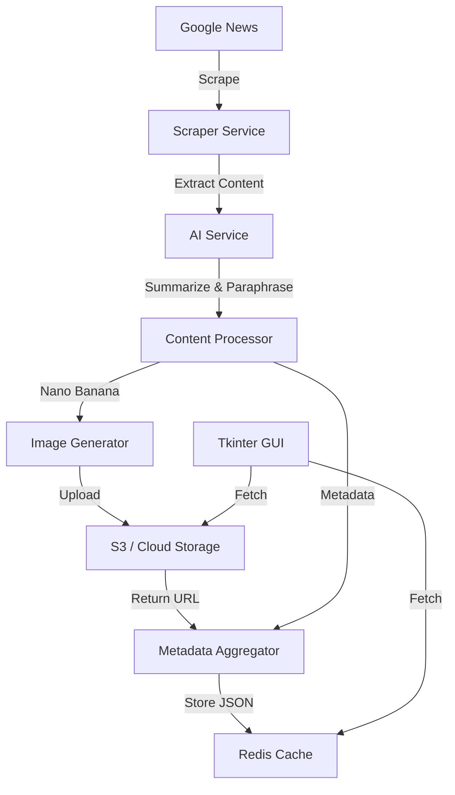

# HomesPh News Scraper & AI Content Generator

This project is a daily automated pipeline that scrapes news from Google News, processes it using AI (Summarization, Paraphrasing, and Image Generation), and stores the results in a hybrid storage architecture (Redis + S3/Cloud Storage) for viewing via a Tkinter GUI.

## 🏗️ Architecture Overview

The system follows a linear pipeline architecture with a centralized metadata store.



## 🛠️ Components

### 1. Scraper Service (`scraper.py`)
- **Source**: Google News RSS or Search.
- **Extraction**: Fetches original links and retrieves full article content using Newspaper3k or similar library.
- **Fields**: Title, Author, Original Link, Publish Date, Raw Content.

### 2. AI Service (`ai_service.py`)
- **Summarization**: Condenses the raw article content into a readable paragraph.
- **Paraphrasing**: Rewrites the original title into a "catchy" or alternate version.
- **Image Generation (Nano Banana)**: Uses the summarized content to generate a prompt and create an AI image representing the news story.

### 3. Storage Layer (`storage.py`)
- **Object Storage (S3)**: Stores the generated `.png`/`.jpg` files from Nano Banana.
- **Metadata Store (Redis)**: Stores a JSON blob for each article:
  ```json
  {
    "id": "uuid",
    "original_title": "...",
    "paraphrased_title": "...",
    "author": "...",
    "content_summary": "...",
    "original_url": "...",
    "image_url": "https://s3.region.amazonaws.com/bucket/image.png",
    "timestamp": "2026-01-18..."
  }
  ```

### 4. Desktop Client (`main_gui.py`)
- **Framework**: Tkinter.
- **Functionality**:
    - Daily cron-like trigger to start scraping.
    - Dashboard to view the "News of the Day".
    - Displaying AI-generated images alongside summarized content.

## 🚀 Getting Started

### Prerequisites
- Python 3.10+
- Redis Server (Local or Cloud)
- AWS S3 Bucket (or equivalent)
- AI API Keys (Google/Nano Banana)

### Setup
1. Clone the repo.
2. Install dependencies: `pip install -r requirements.txt`
3. Configure `.env` (see `env.example`):
   ```bash
   REDIS_HOST=localhost
   REDIS_PORT=6379
   S3_BUCKET_NAME=my-news-images
   AWS_ACCESS_KEY_ID=...
   NANO_BANANA_API_KEY=...
   ```

## 📅 Daily Workflow
1. **Trigger**: System wakes up (Scheduled Task or manual).
2. **Collect**: Scrape top articles from Google News.
3. **AI Magic**: For each article, summarize content, paraphrase title, and generate visual asset.
4. **Persist**: Push image to S3 and save metadata to Redis.
5. **Display**: Update Tkinter GUI with the latest news cards.
